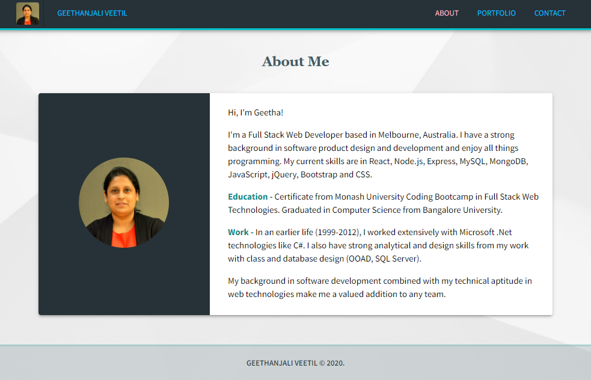
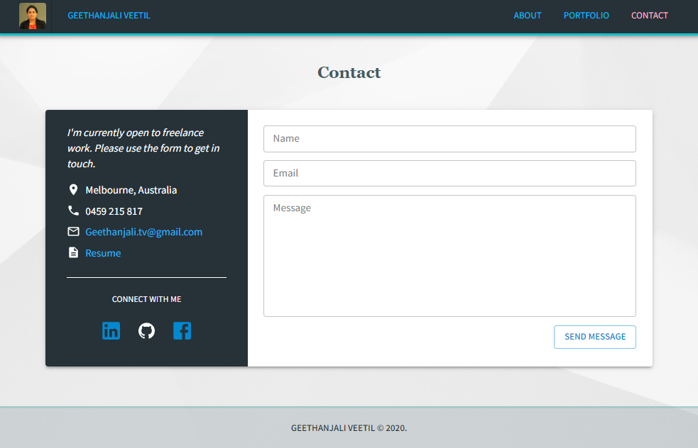

# My Portfolio Website

## Description
 

  

This repository hosts my Portfolio Website. This website presents personal and professional information about me and showcases my work in Web Development. It also provides a simple contact form to allow visitors to reach me.

Deployed Application: [https://gveetil.github.io/](https://gveetil.github.io/) 

## Table of Contents 

- [Technical Features](#technical-features)
 - [Reusability](#reusability)
 - [Responsive Web Design](#responsive-web-design)
- [Usage Guidelines](#usage-guidelines)

## Technical Features

This application is built purely using React and Material UI and uses a json file as the data source. It is currently published as a static site on GitHub Pages.  

### Reusability
This application is built using React components to facilitate re-usability. 

### Responsive Web Design 
Responsive web design provides better accessibility and an optimal viewing experience to the user, by ensuring that web pages render well on different devices and window / screen sizes. To achieve this, I have used the Material UI components to build my pages.

## Usage Guidelines

The website has three main pages which are accessible via links in the navigation bar. These pages are as below:

### About Me Page
  

This is the default page of my website. It contains personal and professional information about me and has my image on it as well. 
 
### Portfolio Page
  

The Portfolio page features a collection of the web projects that I have worked on. Clicking on a web project or on the *visit website* button takes the user to the corresponding project implementation, so they can view how it works. There is also a *view code* button that allows the user to view the code / GitHub repository behind the implemented site. 
Based on the screen size the content on this page adjusts to display 3 projects, 2 projects or just 1 project at a time in each row.
 
### Contact Page
  

The Contact page contains a simple form that allows site visitors to reach me. On submission, the form data is checked to ensure all fields are filled in. If the form data is complete, it is sent to me as an e-mail and a *success* message is displayed if successful. In case of missing data, the user is prompted to complete all fields in the form. The form also displays my contact details and social information about me.

